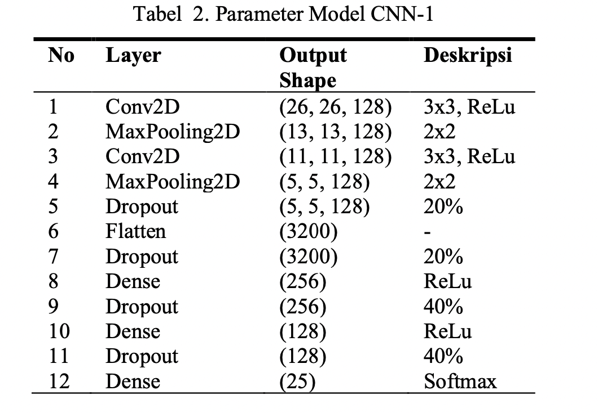
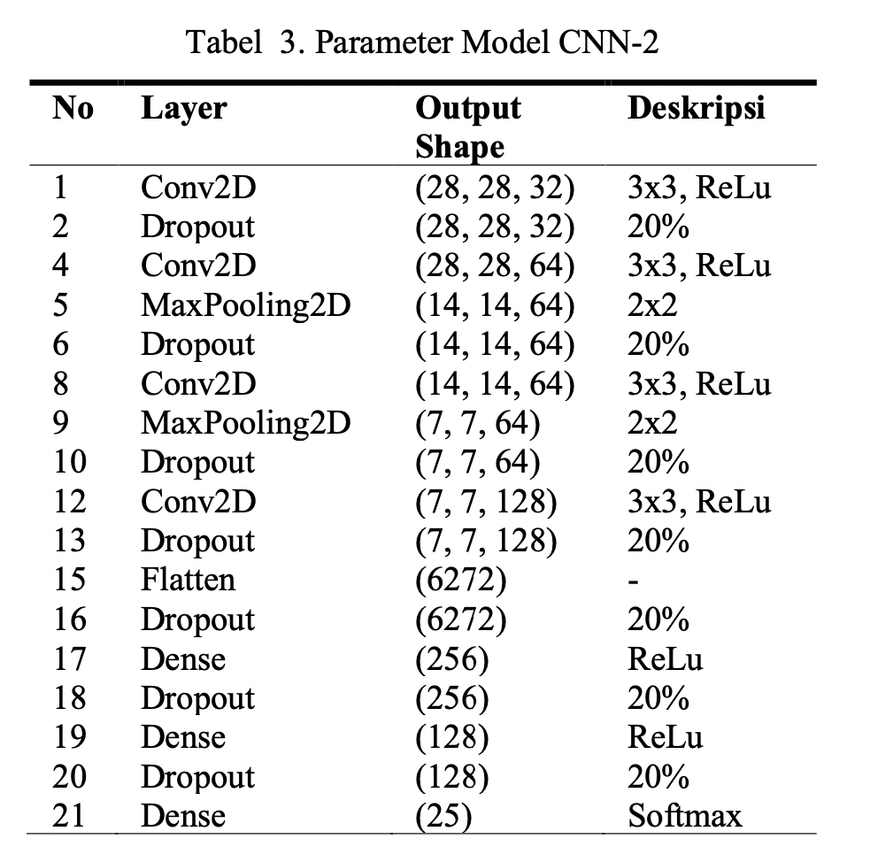
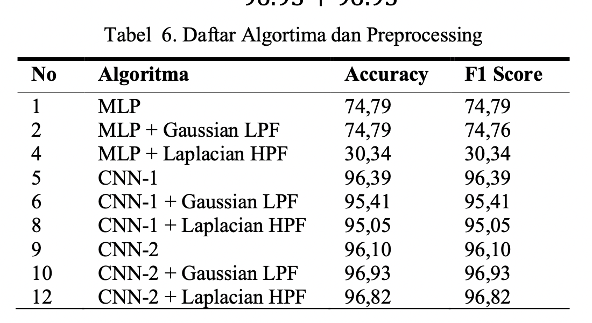
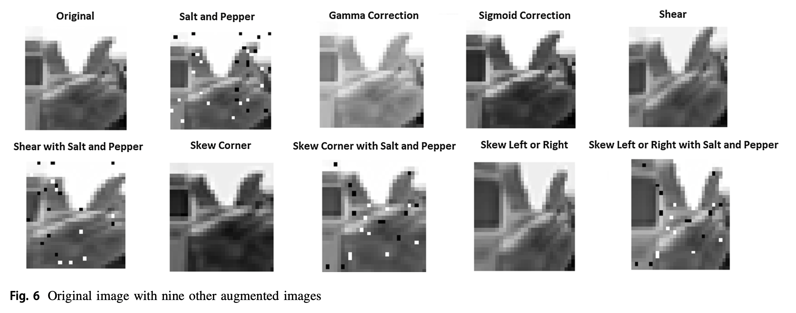
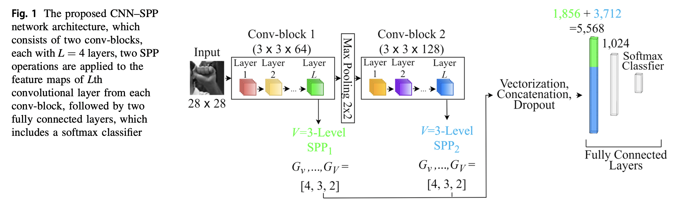
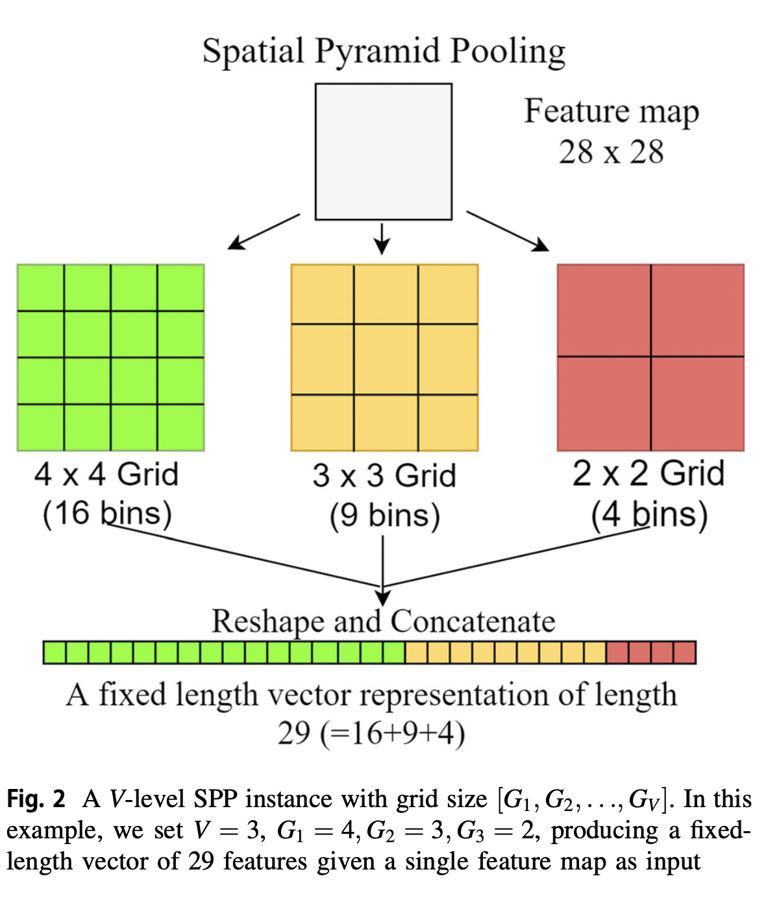
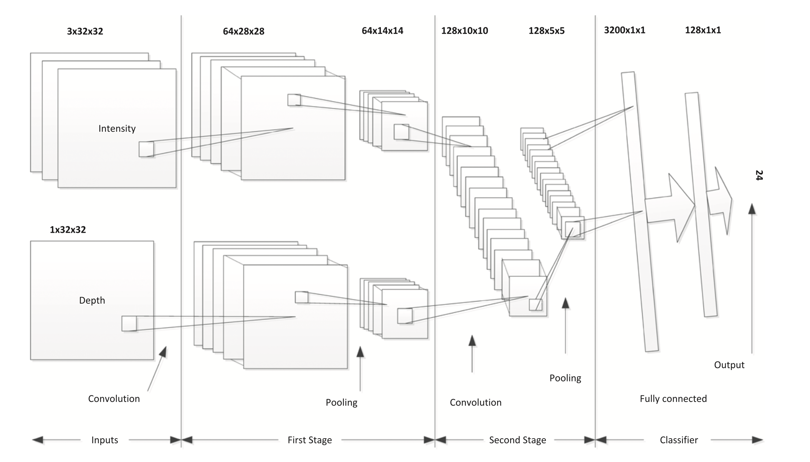

# EE541_project
## Step 1:
find some way to increase the resolution of data picture;\
emphasize the hand part and attenuate the background;\
cut out hand part from the picture;\
Low pass Filter?\
read data into dataset and use dataloader from PyTorch.

## Step 2:
A short literature survey?\
[Article1.pdf](Articles/Article1.pdf)\
[Article2.pdf](Articles/Article2.pdf)\
List reasonable different models.

## Step3:
Experiment with different hyper parameters.
  
## Step4:
Create new test data on our own, get results of accuracy.\
Maybe back to step 2, try another model.

## Step5:
Fine-tune the model finally chosen, we may need to check with professor or TAs.

## Articles
### Article 1 : Analisis Perbandingan Algoritma Klasifikasi MLP dan CNN pada Dataset American Sign Language

### Article 2 : Convolutional neural network with spatial pyramid pooling for hand gesture recognition
This paper outlines a convolutional neural network (CNN) integrated with spatial pyramid pooling (SPP), dubbed CNN–SPP, for vision-based hand gesture recognition.
1. use nine data augmentation to add more data

2. CNN + SPP

### Article 3 : A convolutional neural network to classify American Sign Language fingerspelling from depth and colour images
1. The input consists of an image of a finger sign in the form of three feature maps (YUV components, each with 32 × 32 pixels and one feature map of 32 × 32 pixels for the depth.
2. 
In the first stage, 64 filters (feature maps) are used, each with a 5 × 5 receptive field, no zero padding and a stride of 1, which leads to 64 planes each of dimension 28 × 28. The 64 filters are pooled by a 2 × 2 receptive field with a stride of 2, leading to 64 planes each of dimension 14 × 14. In the second stage, the 128 filters are pooled by a 2×2 receptive field with strideof2, leading to 128×5×5 planes.\
In the second stage, 128 filters with the same receptive field and stride are used, leading to an array of 128 × 10 × 10. Each single number in this dimension is squashed using a Tanh as an activation function.

3. The final layer: The 128‐dimensional feature vectors with a matrix of size 5 × 5 is reshaped to a single 3200‐dimensional vector and used as input to a two‐layer neural net with 128 nodes in the hidden layer and 24 class nodes, one for each letter.

