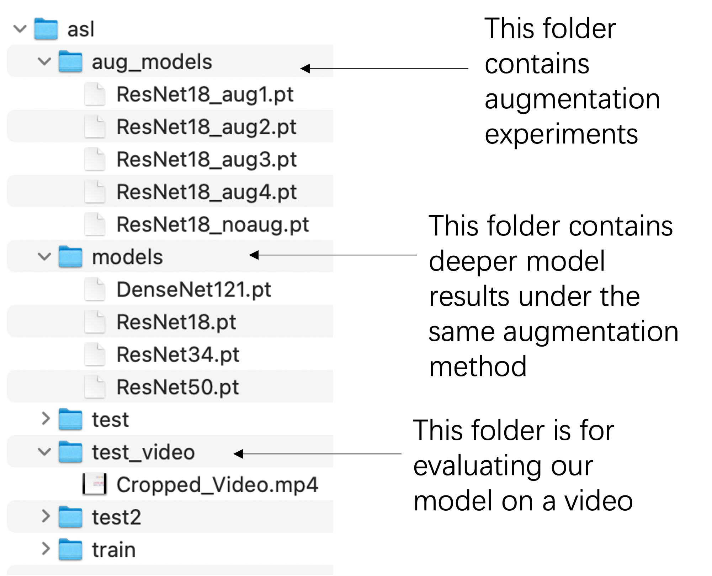
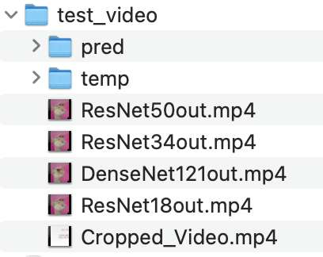

## EE541_project American Sign Lauguage
[GitHubRepo](https://github.com/CaoyiXue/EE541_project.git)
### Before training
1. Make sure you have installed requests, zipfile, shutil, os and open the terminal. Then, Run [DownloadData.py](DownloadData.py)```python3 DownloadData.py``` under the same directory with code. Wait for a few minutes until seeing ```Downloading Completed```\
Or Download data from [Google Drive](https://drive.google.com/file/d/1ibZYZ-O-CFdvlzZwS59jkxJih3juBrHL/view?usp=sharing), roughly 1.5GB\
The structure for this data folder is 
<p align="center"></p>

We run our code on GoogleColab. If you don't use colab, you can skip these code in the beginning.
```python
from google.colab import drive
drive.mount('/content/drive/', force_remount=True)
```
After downloading this data file, modify this code to satisfy the root path where you store data file if necessary.
If you run ```python3 DownloadData.py``` under the same directory with code and don't use GoogleColab, you don't need to modify it.
```python
path = "./"
```
2. You can use [VerifyClass.ipynb](VerifyClass.ipynb) to verify pictures in one data folder corresponds to the class label (data folder name). For example, pictures in filder "A" should has "A" as the first letter of their name. If it doesn't print error information, then it's safe to go next.\
3. We use the HDF5 file to restore our data, so you need to run [BeforeTrain.ipynb](BeforeTrain.ipynb) to get ```data.hdf5```, only need to run "Store data to HDF5 file" part. As a result, you will get ```data.hdf5``` with keys ```train```, ```train_label```, ```test```, ```test_label```, ```test2```, ```test2_label```.\
The rest code on it is calculating mean and standard deviation for our training data, and respectively plot sample pictures from [Kaggle](https://www.kaggle.com/datasets/grassknoted/asl-alphabet) and [Roboflow](https://public.roboflow.com/object-detection/american-sign-language-letters).\
4. In [Noise.ipynb](Noise.ipynb), it shows how torchvision.transforms and two noises we defined look like.

### Training
1. In [SimpleModel.ipynb](SimpleModel.ipynb), we test 4 simple model from Net(), NetDropout(), NetBatchnorm(). And use one simple approach to find the suitable learning rate. Finally, we plot corresponding results for analysis.\
2. In [ResNet18.ipynb](ResNet18.ipynb), we use transfer learning with ResNet18 without freezing to find the suitable augmentation. In our experiments, the "best" one is augmentation 2 mentioned in [ResNet18.ipynb](ResNet18.ipynb).\
3. In [DeeperModels.ipynb](DeeperModels.ipynb), we train 3 deeper models than resnet18, including ResNet34, ResNet50, and DenseNet121 with freezing. Finally, get accuracy on test data and test2 data.\

### Video Test
1. In [VideoTest.ipynb](VideoTest.ipynb), it shows our offline video ASL classification. It will use all loaded models under ```data/asl/models/``` to get corresponding ```*out.mp4```. Then the ```test_video``` folder will like:
<p align="center"></p>

Note: when reload the model from pt file under data folder we give, you need to reload from GPU location.
